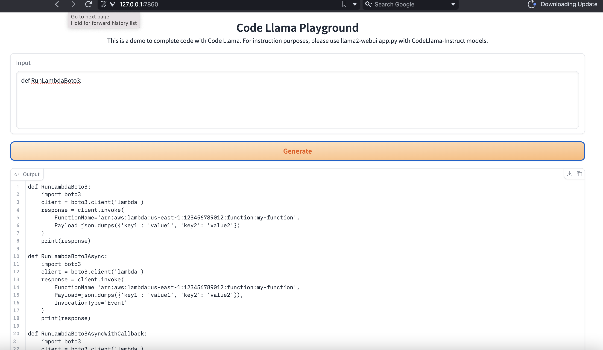
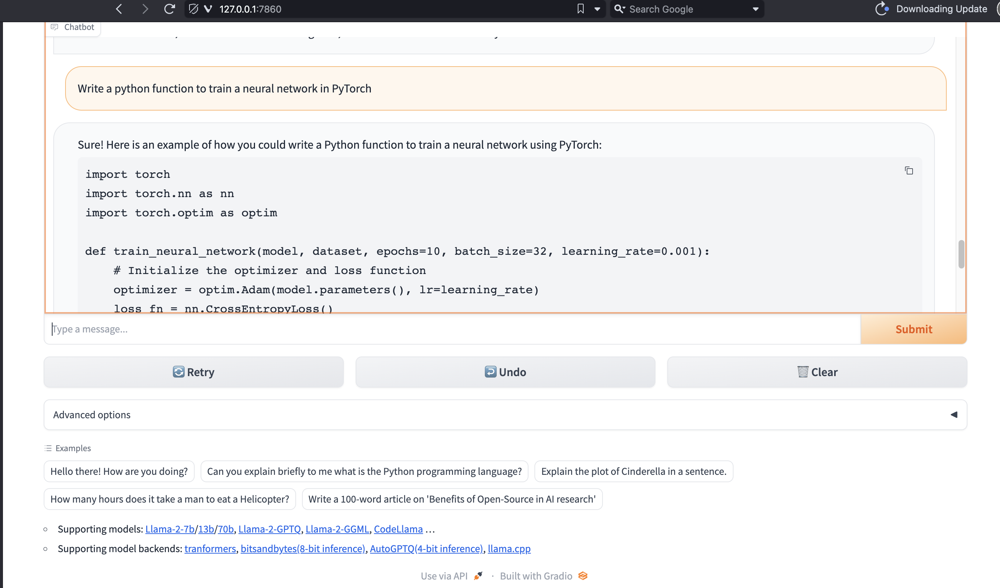

# code-llama-hands-on

# Run Code Llama locally on your computer

1. ## Install Miniconda

https://docs.conda.io/projects/miniconda/en/latest/miniconda-install.html

2. ## Create python environment

```bash
conda create -n codellama-env python=3.10.9 ipython jupyter
conda activate codellama-env
```

3. ## Install llama wrapper

```bash
pip install llama2-wrapper
```

4. ## Clone the llama webui repository

```bash
git clone https://github.com/liltom-eth/llama2-webui.git
```

5. ## Download code models

Models are available at https://huggingface.co/TheBloke  
In this example, we are going to download a code completion and a code instruction chat model 

```bash
cd llama2-webui

python -m llama2_wrapper.download --repo_id TheBloke/CodeLlama-7B-GGUF --filename codellama-7b.Q4_K_M.gguf --save_dir ./models

python -m llama2_wrapper.download --repo_id TheBloke/CodeLlama-7B-Instruct-GGUF --filename codellama-7b-instruct.Q4_K_M.gguf --save_dir ./models
```

6. ## Run code completion chatbot

    ```bash
    cd llama2-webui 
    python code_completion.py --model_path ./models/codellama-7b.Q4_K_M.gguf
    ```
    The open the browser at http://127.0.0.1:7860

     

7. ## Run code instruction chatbot

    ```bash
    cd llama2-webui 
    python app.py --model_path ./models/codellama-7b-instruct.Q4_K_M.gguf
    ```

    The open the browser at http://127.0.0.1:7860

    


